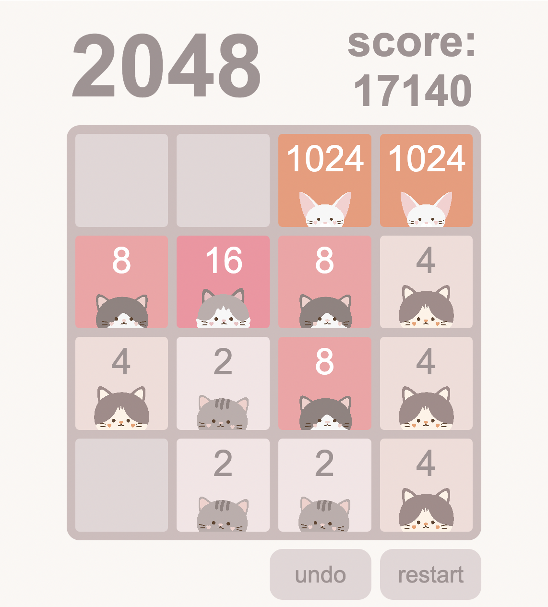

# 2048 - Browser-based Game

## Game Description

2048 is a puzzle game in which the player's goal is to reach the number 2048 by combining matching numbers on a grid. The game is played on a 4x4 grid, and the player can slide the game board tiles in one of four directions each turn (up, down, left, or right). When two tiles with the same number collide, they merge into a new tile with a value that is the sum of the two merged tiles.

The game starts with two tiles, each of value 2 or 4, on the grid, and the player must strategically combine and move the tiles in order to merge up to 2048. The game continues until there are no more possible moves or until the player successfully reaches 2048.

## Game Play

## Technologies Used

    ☐ JavaScript
    ☐ HTML
    ☐ CSS

## Getting Started

https://alyssaalonso.github.io/2048/

## Next Steps

    ☐ Providing an option to continue the game after reaching 2048
    ☐ Adding multiple themes for the player to choose from
